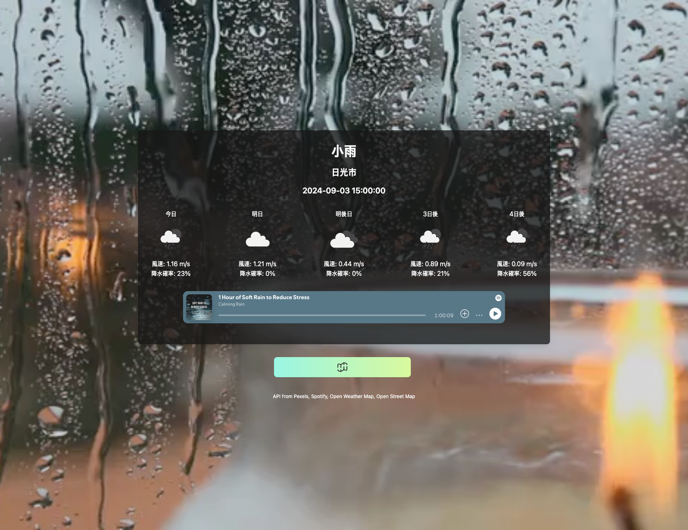
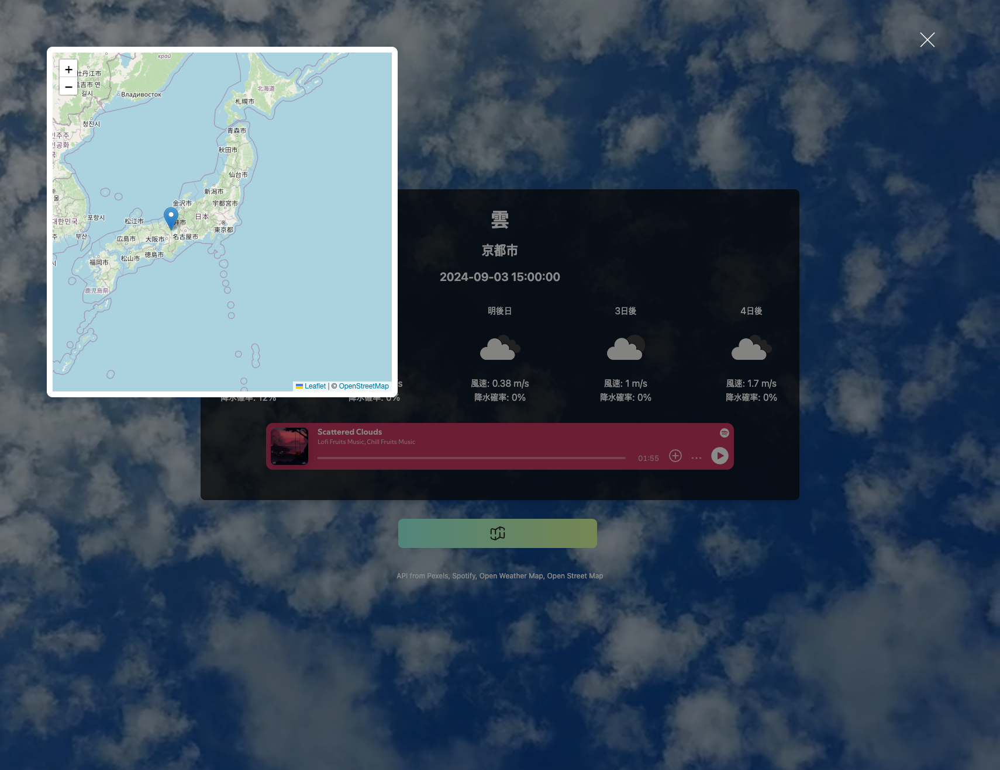

# kadai05_api

# ①課題番号-プロダクト名

天気トーン🎵

## ②課題内容（どんな作品か）

- 今の天気に合わせた音楽と映像を楽しむ

## ③DEMO

- https://cmcz.github.io/kadai05_api/

    
    

## ④作ったアプリケーション用のIDまたはPasswordがある場合

- ID: 今回なし
- PW: 今回なし

## ⑤工夫した点・こだわった点

- 地図で場所を指定できる
- 指定した場所の天気をOpenWeatherMapから取得
- 取得した天気に基づき、適した映像をPexelsから、音楽をSpotifyから取得

## ⑥難しかった点・次回トライしたいこと(又は機能)

- いつも配色にはこだわっているのですが、Spotifyのミュージックプレイヤーでは色の指定ができず、少し使いづらいと感じています。

## ⑦次回ミニ講義で聞きたいこと

同じ機能を実現するには様々な技術がありますが、どのように選ぶのが最適なのでしょうか。 例えば、今Wappalyzerを使って調べたところ、地図機能にはよく使われているのは：

- Google Maps
- Leaflet
- Mapbox.js
- OpenLayers ...

どのように選択すればよいでしょうか。

## ⑧フリー項目（感想、シェアしたいこと等なんでも）
